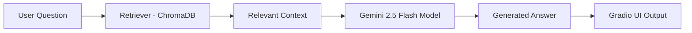

# 🧥 Fashion RAG Chatbot (Gemini)

Bu proje, **Akbank GenAI Bootcamp: Yeni Nesil Proje Kampı** kapsamında geliştirilmiş bir **RAG (Retrieval-Augmented Generation)** tabanlı moda danışmanlığı chatbotudur.  
Sistem, **Gemini API** ve **LangChain** kullanarak kullanıcıların giyim tarzı, vücut tipi ve etkinlik bağlamına göre moda önerileri üretmektedir.  
Proje, yapay zekâ tabanlı öneri sistemlerinin gerçek dünyadaki moda danışmanlığına nasıl entegre edilebileceğini göstermektedir.

---

## 🎯 Projenin Amacı
Bu projenin amacı, kullanıcıların kişisel tarz profiline ve bulunduğu ortama uygun **moda kombin önerilerini** yapay zekâ desteğiyle üretmektir.  
Chatbot, RAG mimarisiyle veri tabanında bulunan moda örneklerinden uygun içerikleri çağırır ve Gemini modeliyle anlamlı yanıtlar oluşturur.

---

## 🧵 Veri Seti
- **Kaynak:** [neuralwork/fashion-style-instruct](https://huggingface.co/datasets/neuralwork/fashion-style-instruct)  
- **İçerik:**  
  Veri kümesi, moda alanında kullanıcı profiline göre oluşturulmuş 3 temel alan içerir:
  - `input`: Kullanıcının tarz profili  
  - `context`: Kombin önerisinin yapılacağı durum  
  - `completion`: Yapay zekânın önerisi  
- **İşleme Aşaması:**  
  Her satır `.txt` dosyasına dönüştürülmüş ve ChromaDB’ye aktarılmıştır.  
  Toplam 3193 adet belge oluşturulmuştur.  

Örnek bir kayıt:
- USER_PROFILE: Klasik giyim tarzını seven bir kadın
- OCCASION: Yaz daveti için kombin önerisi
- RECOMMENDATION: İnce askılı midi elbise, hasır çanta ve açık topuklu sandalet önerilir.

---
## ⚙️ Kullanılan Teknolojiler

| Bileşen | Teknoloji |
|----------|------------|
| 💬 LLM Modeli | Google Gemini 2.5 Flash |
| 🔍 Framework | LangChain |
| 🧠 Embedding Model | sentence-transformers/all-MiniLM-L6-v2 |
| 🗂️ Vektör Veritabanı | ChromaDB |
| 💻 Arayüz | Gradio |
| ☁️ Ortam | Google Colab |

---

## 🧩 RAG (Retrieval-Augmented Generation) Mimarisi

Proje, **RAG (Retrieval-Augmented Generation)** mimarisine dayanır.  
Bu mimari sayesinde chatbot, yanıt vermeden önce veri tabanındaki ilgili moda örneklerini geri çağırır.

**Aşamalar:**
1. Kullanıcının sorusu alınır.  
2. Chroma veritabanından en alakalı 4 belge (`k=4`) geri çağrılır.  
3. Bu belgeler “context” olarak Gemini modeline gönderilir.  
4. Gemini, Türkçe ve kısa bir yanıt üretir.  
5. Yanıt, Gradio arayüzünde kullanıcıya gösterilir.

**Mimari Şema:**


--- 

## 🧠 Elde Edilen Sonuçlar

- Chatbot, kullanıcı girdilerine göre tutarlı ve bağlamsal moda önerileri sunabilmektedir.

- Türkçe dilinde yanıtlar kısa, anlaşılır ve profesyonel bir stil danışmanı üslubuna sahiptir.

- Chroma veritabanı ile hızlı geri çağırma (retrieval) sağlanmıştır.
---  
 ## 💻 Projeyi Kendi Bilgisayarında Çalıştırma
### 1️⃣ Depoyu Klonla
- `git clone https://github.com/nurgldal/Akbank-GenAI-project.git`

### 2️⃣ Proje Klasörüne Gir
- `cd Akbank-GenAI-project`

### 3️⃣ Sanal Ortam Oluştur ve Aktif Et
**Windows:**
- `python -m venv venv`  
- `venv\Scripts\activate`

**Mac / Linux:**
- `python3 -m venv venv`  
- `source venv/bin/activate`

### 4️⃣ Gerekli Kütüphaneleri Kur
- `pip install -r requirements.txt`

### 5️⃣ .env Dosyası Oluştur
Proje dizinine `.env` adında bir dosya oluştur ve içine kendi API anahtarını ekle:
- `GEMINI_API_KEY=senin_api_anahtarın`

> ⚠️ Bu dosya gizli tutulmalıdır ve GitHub’a yüklenmemelidir.  

### 6️⃣ Uygulamayı Çalıştır
- `python app.py`  
veya  
- `python3 app.py`

### 7️⃣ Tarayıcıda Aç
- Terminalde aşağıdaki gibi bir bağlantı göreceksin:  
  `Running on local URL:  http://127.0.0.1:7860`  
- Bu bağlantıyı tarayıcıya yapıştırarak chatbot arayüzüne ulaşabilirsin 🎨

--- 
## ⚠️ Sorun Giderme 

| 🧩 Durum | 💡 Çözüm |
|-----------|-----------|
| ❌ **ModuleNotFoundError** | Bağımlılık eksikse aşağıdaki komutu yeniden çalıştır:<br><br>```bash<br>pip install -r requirements.txt<br>``` |
| ⚠️ **.env dosyası okunmuyor** | - `.env` dosyasının proje dizininde olduğundan emin ol.<br>- Dosya adını **.env** (noktasıyla birlikte) yaz. |
| 🧠 **API hatası** | - API anahtarını doğru yazdığından emin ol.<br>- Eğer **Gemini** kullanıyorsan: `GEMINI_API_KEY`<br>- Eğer **OpenAI** kullanıyorsan: `OPENAI_API_KEY` |
| 🐍 **Python sürümü** | Python 3.10 veya üzeri olmalı.<br><br>```bash<br>python --version<br>``` |
| 🌐 **Gradio açılmıyor** | Güvenlik duvarı veya tarayıcı engelini kontrol et. |


##  📸 Chatbot Çıktıları
 src="https://55ccc9518a5b5308db.gradio.live" 
 
 
 
 


  

